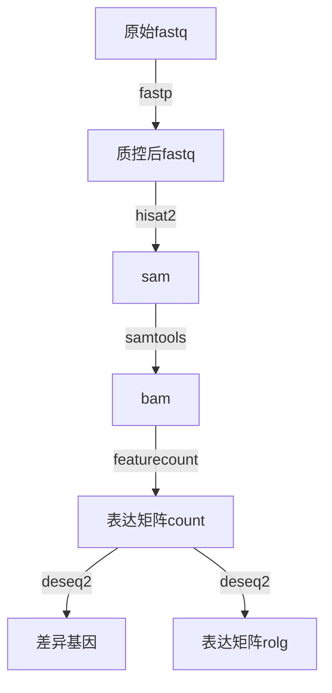

# 数据处理

## 差异基因计算流程



## 差异基因计算

1. 使用fastp,去接头并进行质控
```shell
    ${fastp} \
        -w ${thread} \
        -i ${data}/${sample}_1.fq.gz \
        -I ${data}/${sample}_2.fq.gz \
        -o ${qc_dir}/${sample}_1_trimmed.fq.gz \
        -O ${qc_dir}/${sample}_2_trimmed.fq.gz \
        --report_title ${sample} \
        --html ${qc_dir}/${sample}.html \
        --json ${qc_dir}/${sample}.json \
        2>&1 >fastp.log
```

2. 使用hisat2进行mapping
```shell
    ${hisat2} \
        -p ${thread} \
        -x ${index} \
        -1 ${qc_dir}/${sample}_1_trimmed.fq.gz \
        -2 ${qc_dir}/${sample}_2_trimmed.fq.gz \
        -S ${sam} \
        --novel-splicesite-outfile ${mapping_dir}/${sample}.junctions \
        2>&1 >hisat2.log

    ${samtools} view -bS -@ ${thread} ${sam} >${bam}
    ${samtools} sort -@ ${thread} -o ${bam_sort} ${bam}
    ${samtools} index -@ ${thread} ${bam_sort} ${bam_sort_index}
```

3. 使用featurecounts进行计数
```shell
    ${featurecounts} \
        -T ${thread} \
        -a ${gtf} \
        -o ${count_dir}/${sample}.featureCounts.count \
        -p \
        ${bam_sort} \
        2>&1 >featurecounts.log
```

4. 使用deseq2计算差异基因


+ 准备
```R
ctrl <- "C"
case <- "P"

count_mat <- df %>%
    column_to_rownames("gene") %>%
    select(
        starts_with(ctrl),
        starts_with(case)
    ) %>%
    as.matrix()

colData <- tibble(Samplename = colnames(count_mat)) %>%
    mutate(
        condition = case_when(
            grepl(ctrl, Samplename) ~ ctrl,
            grepl(case, Samplename) ~ case
        ),
        condition = factor(condition, levels = c(ctrl, case))
    )

colData %>%
    write_csv("colData.csv")
```

+ 计算
```R
dds <- DESeqDataSetFromMatrix(count_mat, colData, design = ~condition)
dds <- dds[rowSums(counts(dds)) > 0, ]
dds2 <- DESeq(dds)
```

+ 保存差异基因结果
```R
res <- results(dds2)

res %>%
    as.data.frame() %>%
    rownames_to_column("gene") %>%
    arrange(padj) %>%
    inner_join(
        counts(dds2, normalize = TRUE) %>%
            as.data.frame() %>%
            rownames_to_column("gene")
    ) %>%
    left_join(
        df %>%
            select(gene, gene_name)
    ) %>%
    write_csv("res_data.csv")
```

+ 保存rlog变换后的矩阵
```R
rld <- rlog(dds2)
rld %>%
    assay() %>%
    as.data.frame() %>%
    rownames_to_column("gene") %>%
    as_tibble() %>%
    left_join(
        df %>%
            select(gene, gene_name)
    ) %>%
    write_csv("rlog_data.csv")
```