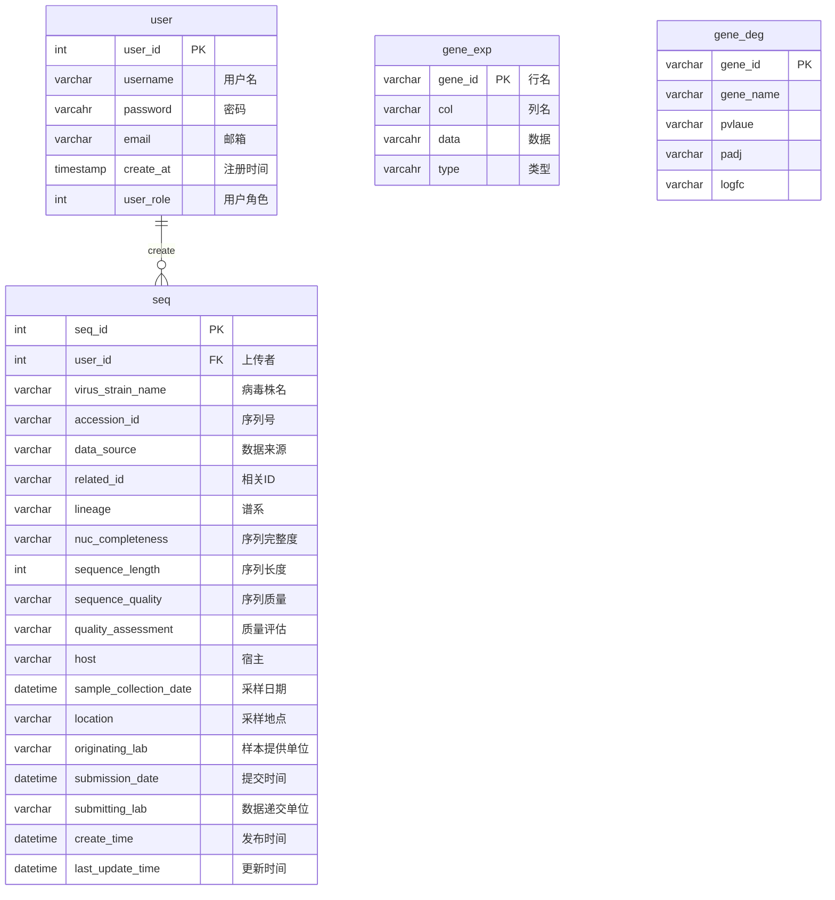

# 数据库设计

1. 用户模块: 
    + user 表

        | user_role.value | annotation |
        | :-: | :-: |
        | 0 | 普通用户 |
        | 1 | 管理员 |

    + user_action

3. 基因模块: 
    + seq 表
    + gene_deg 表
    + gene_exp 表

