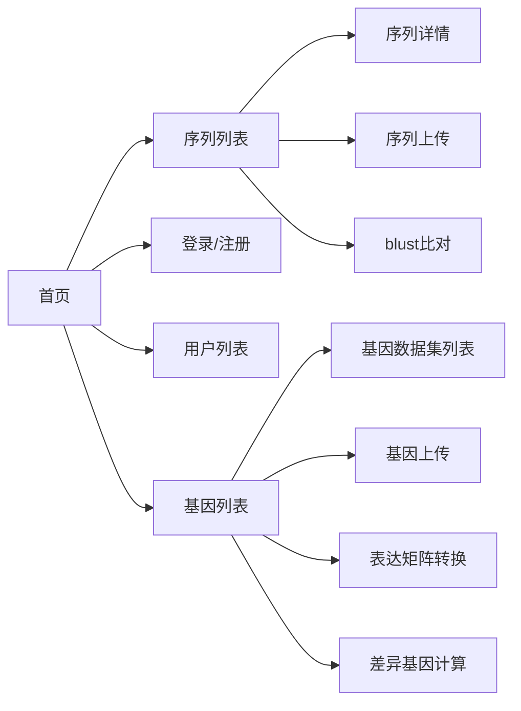
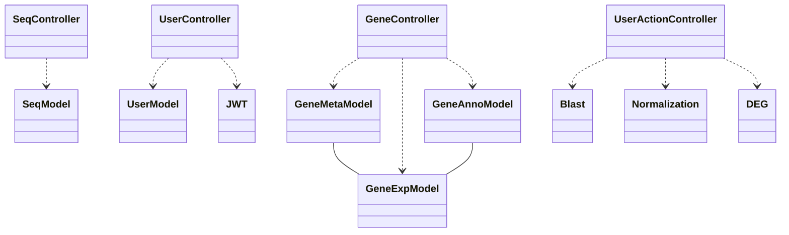

# 环境描述与开发技术
  
+ 前端: 
    + vue3
    + echarts +  qausar
    + vitepress
  
+ 后端：
    + lamp
    + thinkPHP 5.1.41

#  基本设计

# 类关系图

# 权限设计

1. 序列(基因)数据操作

| 操作 | 匿名用户 | 普通用户 | 管理员 |
|-|-|-|-|
| 增 | F | T(个人) | T |
| 删 | F | T(个人) | T |
| 改 | F | T(个人) | T |
| 查 | T | T | T |

2. 用户管理

| 操作 | 匿名用户 | 普通用户 | 管理员 |
|-|-|-|-|
| 增 | T | F | F |
| 删 | F | T(个人) | T |
| 改 | F | T(个人) | T |
| 查 | F | T(个人) | T |

3. 用户服务

| 操作 | 匿名用户 | 普通用户 | 管理员 |
|-|-|-|-|
| blust | F | T | T |
| 表达矩阵转换 | F | T | T |
| 差异基因 | F | T | T |

4. 注
    + 所有请求头需添加时间戳`Time`
    + 权限请求需添加tocken`X-Authorization`

