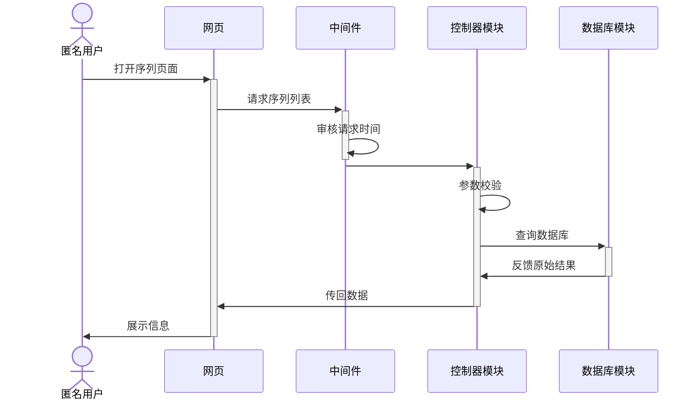
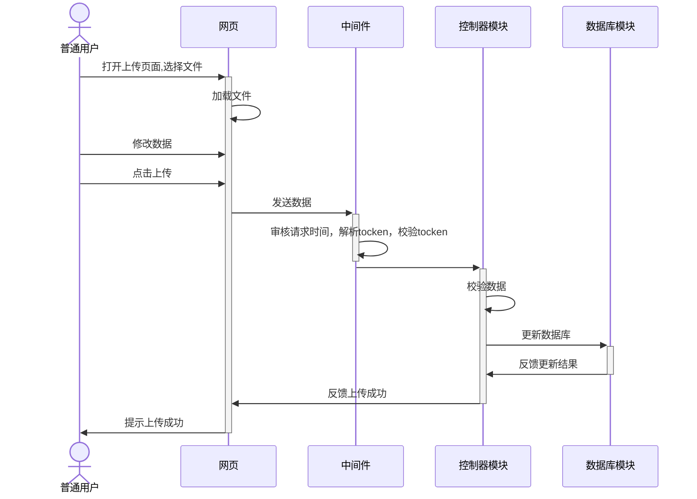
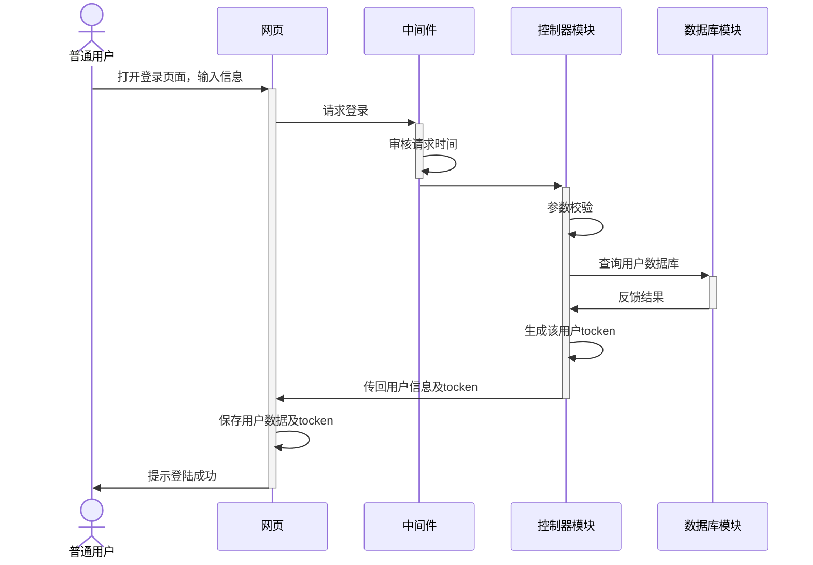

# 功能概述

## 基因数据
  
### 1. 序列数据查询
### 2. 基因表达数据查询

```mermaid
sequenceDiagram
actor 匿名用户
participant 网页
participant 中间件
participant 控制器模块
participant 数据库模块

匿名用户->>+网页: 打开序列页面
网页->>+中间件: 请求序列列表
中间件->>-中间件: 审核请求时间
中间件->>+控制器模块: 
控制器模块->>控制器模块: 参数校验
控制器模块->>+数据库模块: 查询数据库
数据库模块->>-控制器模块: 反馈原始结果
控制器模块->>-网页: 传回数据
网页->>-匿名用户: 展示信息

```
  
### 3. 增(逐条或批量)删改序列数据
### 4. 查基因表达数据(表达矩阵)

```mermaid
sequenceDiagram
actor 普通用户
participant 网页
participant 中间件
participant 控制器模块
participant 数据库模块

普通用户->>+网页: 打开上传页面,选择文件
网页->>网页: 加载文件
普通用户->>网页: 修改数据
普通用户->>网页: 点击上传
网页->>+中间件: 发送数据
中间件->>-中间件: 审核请求时间，解析tocken，校验tocken
中间件->>+控制器模块: 
控制器模块->>控制器模块: 校验数据
控制器模块->>+数据库模块: 更新数据库
数据库模块->>-控制器模块: 反馈更新结果
控制器模块->>-网页: 反馈上传成功
网页->>-普通用户: 提示上传成功

```
  
## 用户服务
  
### 1. 登录

```mermaid
sequenceDiagram
actor 普通用户
participant 网页
participant 中间件
participant 控制器模块
participant 数据库模块

普通用户->>+网页: 打开登录页面，输入信息
网页->>+中间件: 请求登录
中间件->>-中间件: 审核请求时间
中间件->>+控制器模块: 
控制器模块->>控制器模块: 参数校验
控制器模块->>+数据库模块: 查询用户数据库
数据库模块->>-控制器模块: 反馈结果
控制器模块->>控制器模块: 生成该用户tocken
控制器模块->>-网页: 传回用户信息及tocken
网页->>网页: 保存用户数据及tocken
网页->>-普通用户: 提示登陆成功

```

### 2. 删查用户信息
> [注]: 普通用户仅可操作个人信息  
### 3. blast比对
