# 使用介绍

## 1.网站数据简介

新型冠状病毒（2019-nCoV）作为新型冠状病毒肺炎疫情的致病源，在出现至今的三年间一直是各个国家的研究热点。 本网站主要搜集了国家生物信息中心（CNCB）/国家基因组科学数据中心（NGDC）网站中2019年以来中国地区人类2019-nCoV（宿主为人类）的基因组信息， 包含来自中国 **83**多个不同城市(地区)、 **119** 个不同谱系病毒的共计**3113**条数据， 其中完整序列的比列可达**83.04%**。 除提供病毒株名，序列号，ID，采样、递交和上传时间等常规信息外， 本网站还提供了对序列完整度为“Complete”的基因组序列进行检测得到的质量评估结果。 该结果从包未知碱基（N）、简并碱基（非ATGCN的碱基）数量、 与参考序列（MN908947）比对后出现的gap（deletion、insertion、indel）数量、变异总数、变异密度 （变异数/区间长度，区间长度<= 20nt）5个维度反映了序列的整体质量， 对研究人员的选择和判断具有一定的参考价值。        

除研究病毒本身外，该病毒对人类的影响也是一大研究热点。人类感染新型冠状病毒（2019-nCoV）后，多组织器官会受到不同程度的不良影响。已有数据显示，新型冠状病毒会导致心脏受损。为了探究感染病毒带来的基因表达差异，挖掘新型冠状病毒基因诱导人类心脏异常的可能分子机制，我们选取了一则新近相关研究中的RNA-seq数据并进行了blast、差异表达基因计算等分析。该组数据其来自于对人类多能干细胞衍生的心肌细胞进行的bulk测序，GEO数据库序列号GSE171742。

## 2.网站使用说明

### 2.1 综合查询

点击上方工具栏“**首页**”按钮进入网站首页。首页提供网站数据来源的文字简介和一个**综合搜索框**，框内可进行全局搜索。

图1. 网站首页示意

 ### 2.2序列数据查询

#### 2.2.1数据展示

点击上方工具栏“**序列数据**”按钮进入序列详情页，点击右上角方框按钮可实现全屏。该页面右侧默认展示所有病毒株的全部信息，可通过点击列名旁的**箭头按钮**实现整个表格以该列为**关键字**的正/倒序排序。可在页面下方下方**下拉菜单**内可选择每页展示的条目数，并通过点击**左右箭头**实现页面跳转。

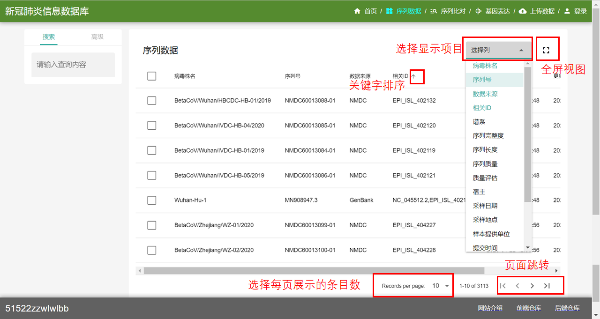
图1. 序列数据界面示意

#### 2.2.2高级检索

在无法明确所需的病毒类型时，可点击左侧的“**搜索**”按钮“**高级**”按钮，按照需要选择病毒株名、序列号、数据来源、序列长度等条件进行检 索，提高检索精确度。

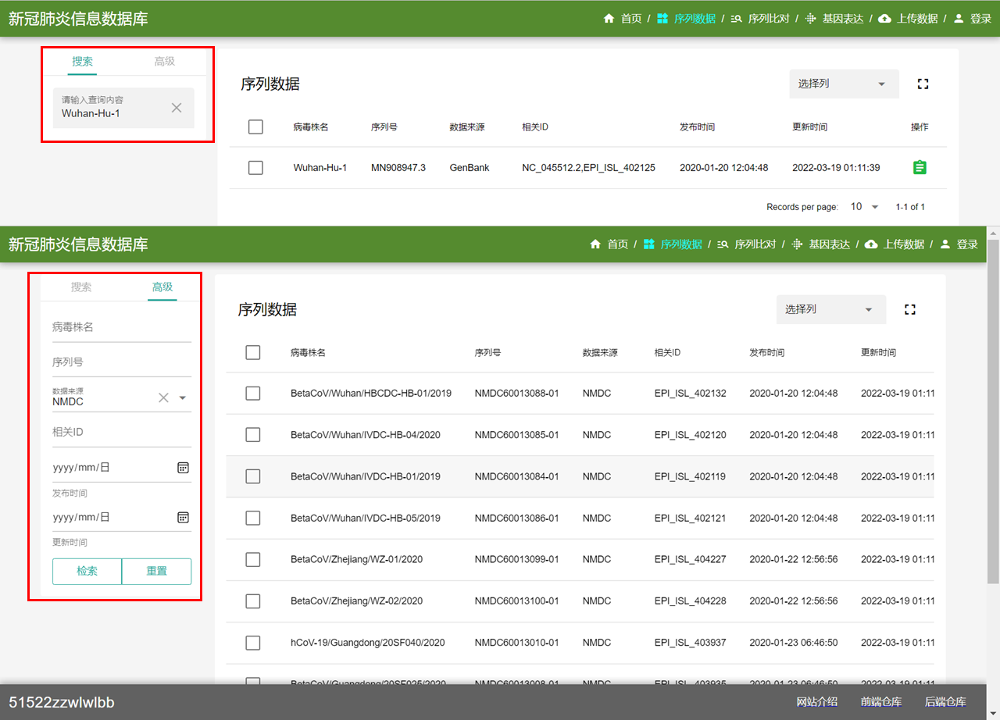
图2. 高级检索示意

### 2.3 Blast对比

 点击上方工具栏“**序列数据**”按钮进入序列对比页面。在左侧“**请输入查询序列**”框内属于序列，点击下方查询按钮后，右侧即会出现blast结果。**word size**和**evalue**均为整数，默认值为0，可根据显示需要点击数字右端的**上/下箭头**增大/减小具体值。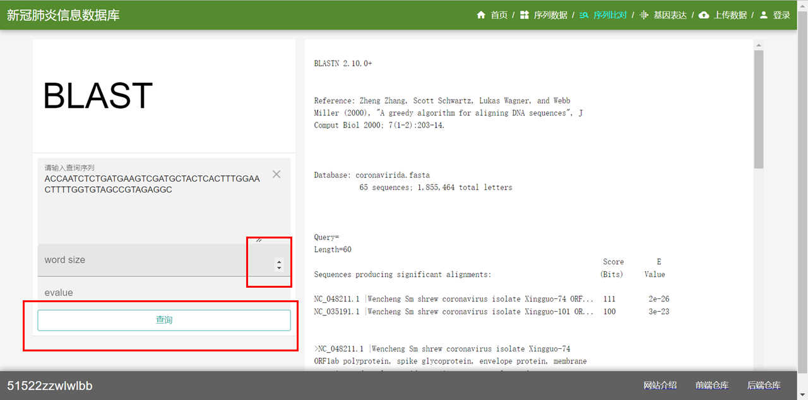
图3. Blast对比示意

### 2.4 差异表达基因计算与可视化

点击上方工具栏“**基因表达**”按钮进入基因表达结果展示页面。

#### 2.4.1全部差异表达基因——火山图

在未选择具体基因时，右侧展示的是所有差异表达基因的火山图，每个点代表一个差异表达基因。可在左侧列表下方调节差异表达基因的筛选阈值。当把光标放在某个点上时可显示基因名称，adjust_P value 和log ~2~ FoldChange值。右上角三个按钮从左向右依次可实现局部放大，恢复原视图和下载功能。

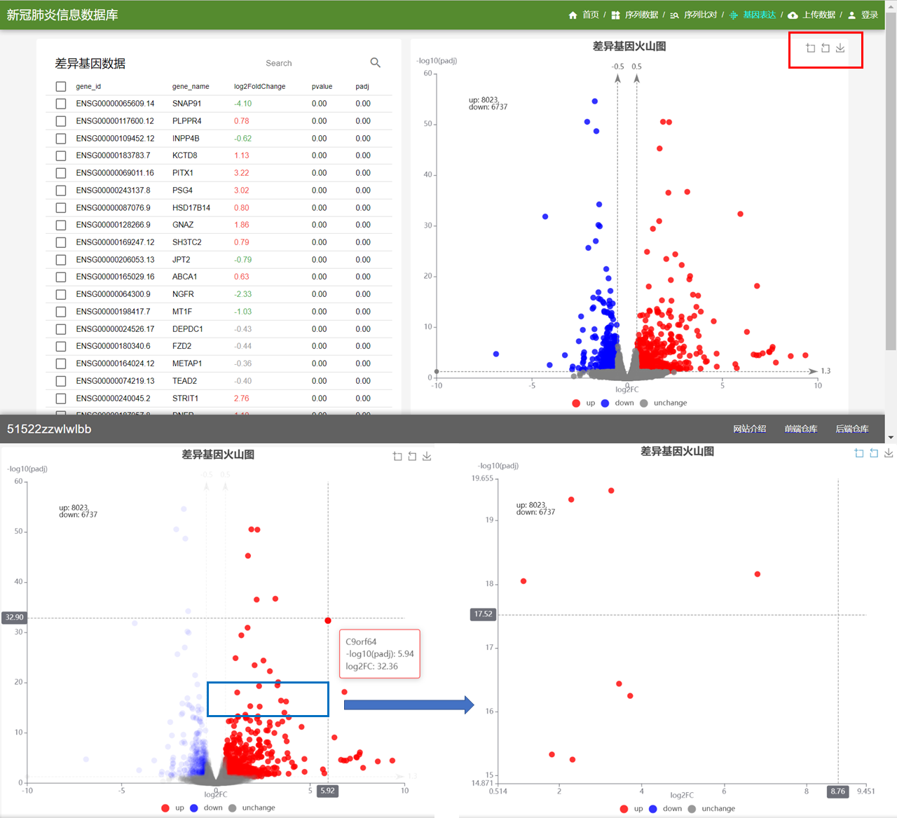
图4. 火山图界面及放大效果示意

### 

#### 2.4.2 部分差异表达基因——动态热图

在左侧框选具体基因后（此处同样提供基因检索功能），右侧可动态生成不同样品之间所选基因的差异表达热图。当把光标放在某个色块上时可显示基因名称，rlog值和所来源样品的名称。点击右上角按钮可实现热图的下载。

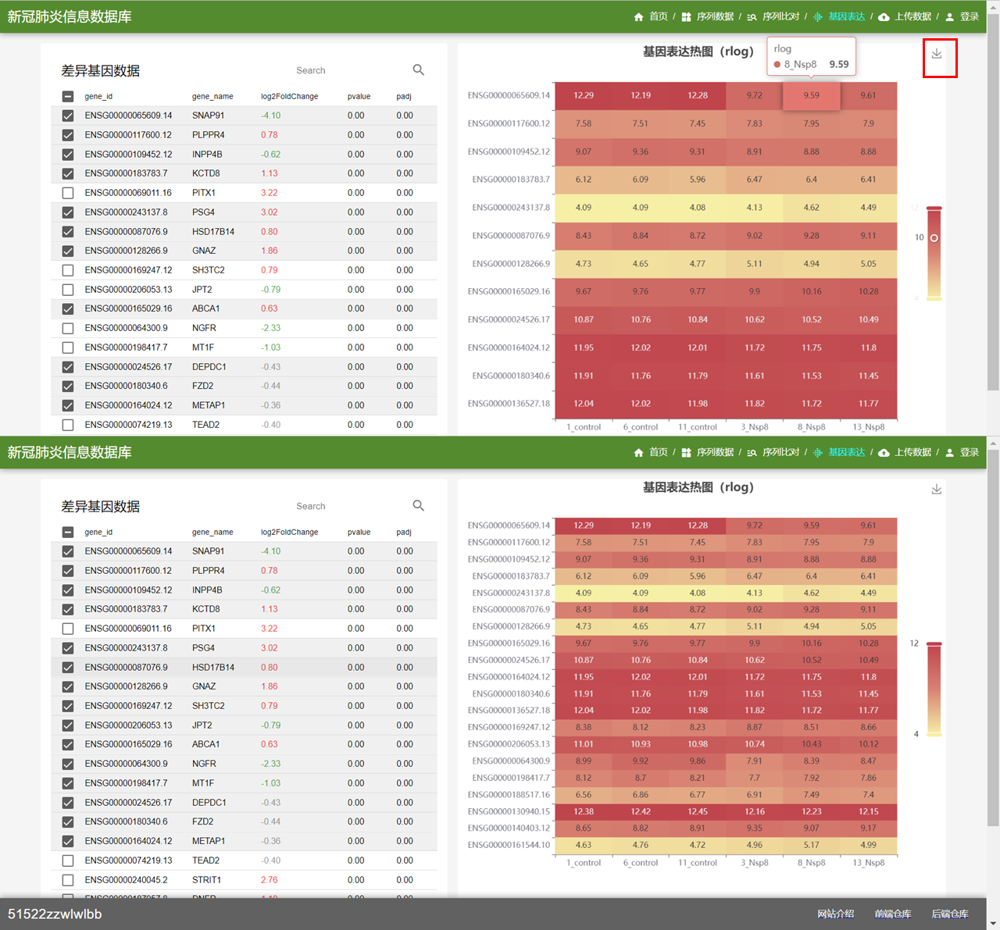
图5. 动态热图界面示意

### 2.5 增（逐条/批量）删改序列数据

#### 2.5.1增添数据

点击上方工具栏“**上传数据**”按钮，在页面内进行用户登录或注册（该部分详细信息见“用户服务”部分），增删改功能均需要用户登录后才可使用。

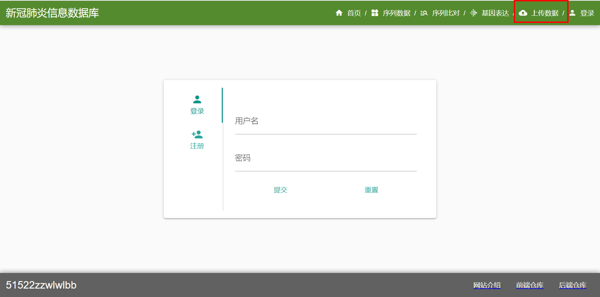
图6. 未登录用户”上传数据“界面示意

该网站提供两种上传数据的方式，可根据自身需要选择单条添加或文件批量导入（文件格式限.csv/.tsv ，每次只可上传1个文件）。网站读取文件中包含的数据以列表形式显示在右侧，点击具体数据可对其进行单独修改，也可自行框选希望上传的条目。

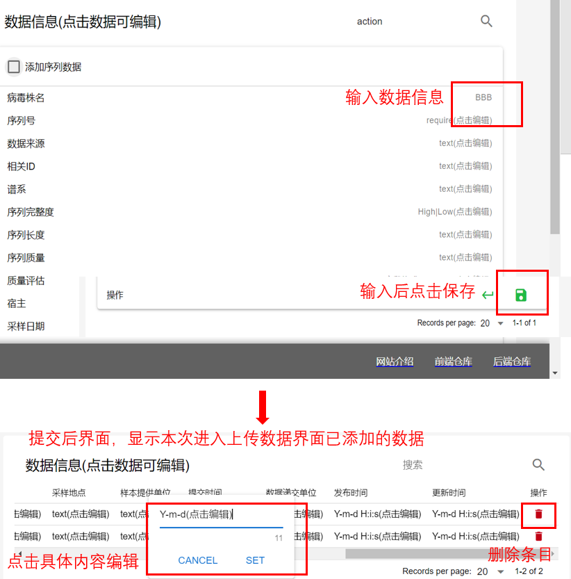
图7. 单条添加数据操作示意

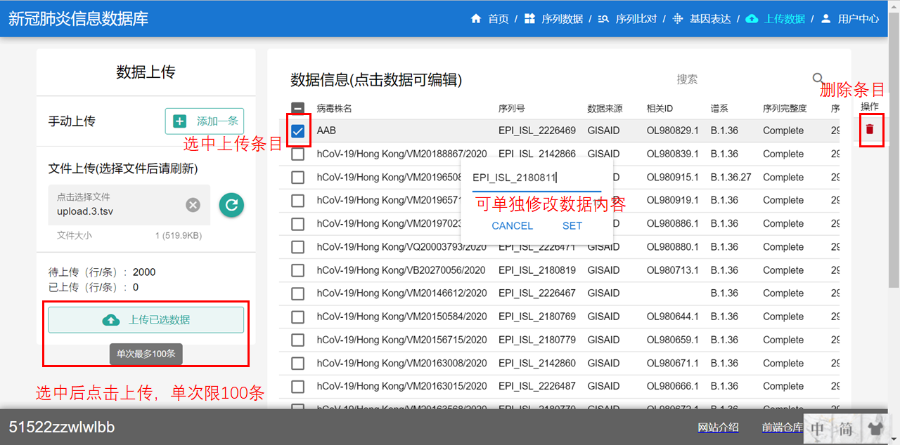
图8. 文件批量导入添加数据操作示意

#### 2.5.2 删改数据

在“上传数据”界面可对刚上传的数据进行删改。删改之前上传的数据，用户需要登录后点击上方工具栏“**序列数据**”按钮进入序列详情页，在“操作”栏点击红色按钮进行删除或点击绿色“详情”按钮进行修改，普通用户只可删改自己上传的数据，管理员可删改所有数据。

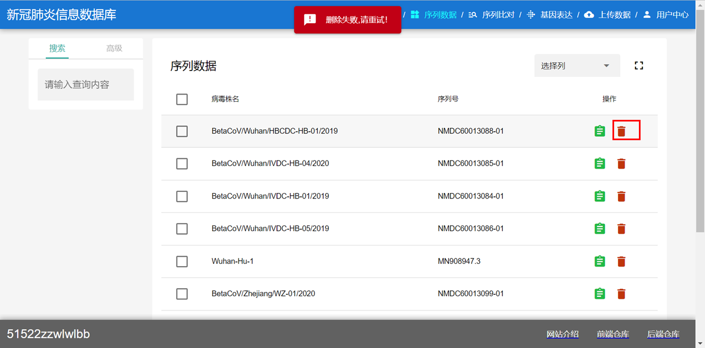
图9. 普通用户对他人数据进行删除操作结果示意

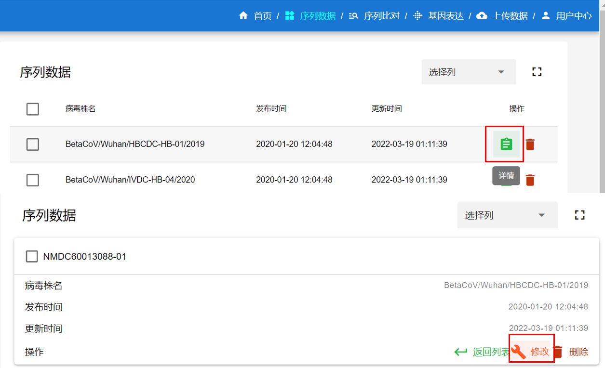
图10. 修改已上传数据操作示意

## 3. 用户服务

### 3.1用户注册和登录

点击上方工具栏“**用户中心**”按钮，可出现用户登录或注册的界面。用户可选择在该界面内登录后进入上传数据界面。或直接点击“**上传数据**”按钮，也可跳转至用户登录或注册界面。新用户根据页面提示填写相关信息中可选择重置，填写完成后提交即可成功注册。

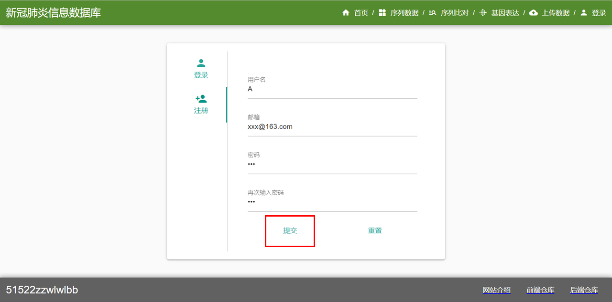
图11. 用户注册界面示意图

### 3.2 用户权限

#### 3.2.1 普通用户

普通用户注册后在“**用户中心**”可以看到自己的用户信息，点击左上角对钩选中用户后，可点击下方“**退出登录**按钮退出登录或右下角**红色图标**选择注销用户。
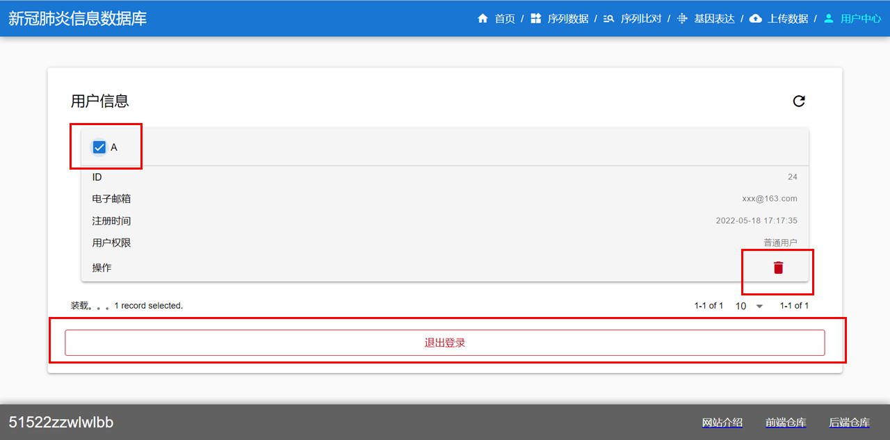
图12. 普通用户“用户中心”界面示意图

#### 3.2.2 管理员

管理员登录后在“用户中心”可查看所有注册用户的详细信息，点击右上角开关图标打开/管壁卡片视图。
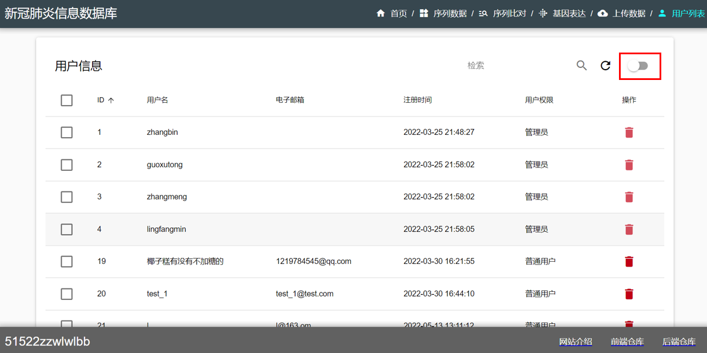
图13. 管理员“用户中心”界面示意图

