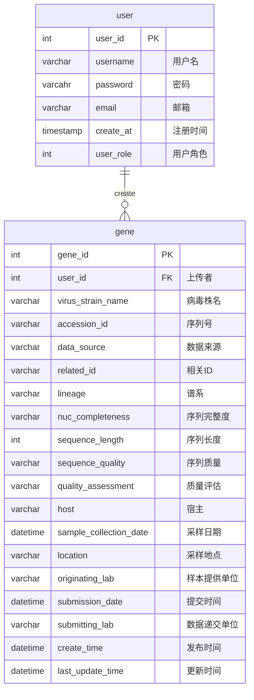

1. 用户模块: 
    + user

        | user_role.value | annotation |
        | :-: | :-: |
        | 0 | 普通用户 |
        | 1 | 管理员 |

3. 基因模块: 
    + gene

```mermaid
erDiagram 

user {
    int user_id PK
    varchar username "用户名"
    varcahr password "密码"
    varchar email "邮箱"
    timestamp create_at "注册时间"
    int user_role "用户角色"
}

gene {
    int gene_id PK 
    int user_id FK "上传者"
    varchar virus_strain_name "病毒株名"
    varchar accession_id "序列号"
    varchar data_source "数据来源"
    varchar related_id "相关ID"
    varchar lineage "谱系"
    varchar nuc_completeness "序列完整度"
    int sequence_length "序列长度"
    varchar sequence_quality "序列质量"
    varchar quality_assessment "质量评估"
    varchar host "宿主"
    datetime sample_collection_date "采样日期"
    varchar location "采样地点"
    varchar originating_lab "样本提供单位"
    datetime submission_date "提交时间"
    varchar submitting_lab "数据递交单位"
    datetime create_time "发布时间"
    datetime last_update_time "更新时间"
}


user ||--o{ gene : "create"

```
